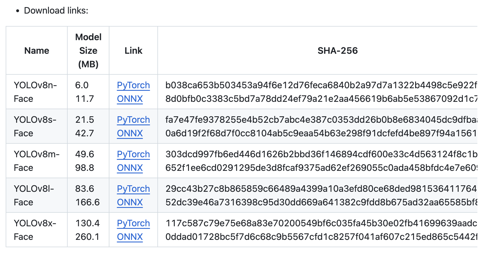

# Blur Project

## Prerequisites Commands

To set up the environment for the **Blur** project, follow these detailed steps:

### 1. Create a Virtual Machine
Set up a virtual machine using your preferred tool (e.g., VirtualBox, VMware, or a cloud provider). Ensure the virtual machine has Python installed.
Python 3.10 is recommanded.

For example :
```bash
python3.10 -m venv .venv
```
Then, enter your virtual machine :
```bash
source .venv/bin/activate
```


### 2. Install Dependencies
Run the following commands to install the required dependencies:

```bash
pip install -r requirements.txt
```

### 3. Accepted formats of files

Here are the accepted formats (others have not been tested) : 
- photos : `.jpg`, `.jpeg`, `.png`
- videos : `.mp4`, `.mov`, `.m4v`

## Execution
To blur the faces on your pictures or videos, follow these simple steps :

- Add your files (or folder) to the same repository of the `main.py` file.
- Execute the following line in your command line :
```bash
python main.py name_of_file_or_folder.extension
```
- Wait for the process (the progress bar indicates how long it will take - usually really fast for photos, longer for videos)

If you give a name of folder, all the files in the folder will be processed.
The files will be saved at the same place of the original ones.

#### Images
Images will be named the same as the original ones, with `_blurred` at the end of their name (and the same extension).

#### Videos
Once the execution is finished, you end up with 3 different files :

- `filename_blurred.extension` : this is the original video, with all faces blurred
- `filename_blurred_anonymized.extension` : this is the video with all faces blurred and voices anonymized
- `filename_blurred.extension.srt` : this is the subtitles file. They are not added by default to the videos, but you can add them with the following command :
```bash
ffmpeg -i video_to_subtitle.extension -vf subtitles=filename.extension.srt -c:a copy output_filename.extension
```
Note that the subtitles can be imperfect sometimes, you can modify the text and even the timestamp in the `.srt` file by opening it in a text editor. You will have to execute the command above again after modifying the file to update the video.

### Real time video blur
You can also blur your face in real time with your camera :
```bash
python realtime_blur.py
```
You can switch between basic and pixelated blur by clicking on `b` or `p`.


For both pre-recorded or realtime blur, you can change the power of the pixelated blur by changing the `pixel_size` variable in the `config` file. For `pixel_size`, the higher it is, the better we will guess who is behind the blur. For `blur_size`, the higher it is, the less we will guess. Note that for blur_size, the number has to be odd.

### Optional : Change the voice anonymization
To anonymize the voice, we created a non-inversible method, using fast fourier transformations. However, depending on the speaker's voice, anonymization may be more or less satisfactory. To modify the result, you can change the value of the `shift_amount` variable in the `config` file.

### Optional : Different blur types
The basic blur method is to pixelize the faces, but you can add the following `blur` argument to your command line to have a gaussian blur :
```bash
python blur.py name_of_file_or_folder.extension --blur
```

### Optional : Upgrade performances
The script uses the YOLO model, which has different versions, and impacts the performances and the precision of the detection. Here, the `yolov8n` model is used, which is the smallest one, but you can download and use some different models on the [github page](https://github.com/lindevs/yolov8-face) by clicking on the `ONNX` link (AND ONLY ONNX TYPE, NOT PYTORCH, TO AVOID BACKDOORS), as shown on the picture below :

Make sure to add it to the `utils` folder, and to change the name in the variable `model` located in the `config` file.

## Acknowledgements
This project uses the YOLOv8-Face model provided by [lindevs/yolov8-face](https://github.com/lindevs/yolov8-face), which offers pre-trained YOLOv8 models specifically optimized for face detection.

The original models were trained on the WIDERFace dataset and are released under the AGPL-3.0 license.

## LICENSE

This project is released under the GNU Affero General Public License v3.0 (AGPL-3.0), which requires that:

- If you redistribute this project or use it in a public-facing service (e.g., a web API or SaaS platform), you must also publish your full source code, including any modifications.
- If you wish to use this project in a closed-source commercial product, you must obtain a [commercial license from Ultralytics](https://ultralytics.com/license)

### Commercial Use
You are free to use this project for commercial purposes as long as it remains open source and complies with the AGPL-3.0 requirements for YOLOv8. If you plan to keep your code private or integrate it into proprietary software, you must either replace YOLOv8 with an alternative model under a more permissive license (e.g., MIT or Apache 2.0), or purchase a commercial license from Ultralytics.

Please ensure you understand and comply with all relevant licenses before deploying or distributing this project.