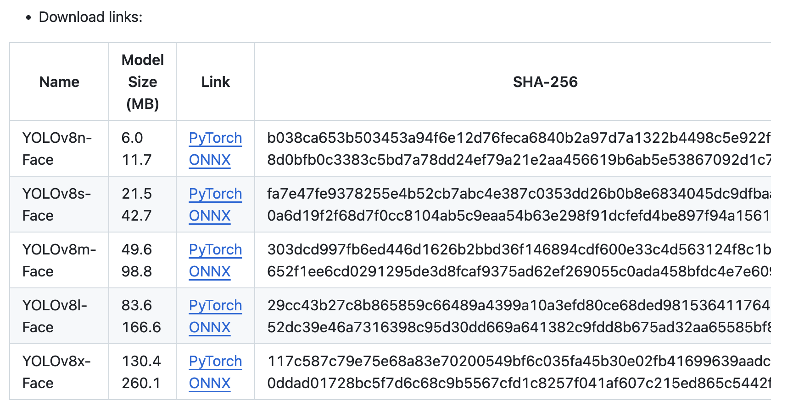

# Blur Project

## Prerequisites Commands

To set up the environment for the **Blur** project, follow these detailed steps:

### 1. Create a Virtual Machine
Set up a virtual machine using your preferred tool (e.g., VirtualBox, VMware, or a cloud provider). Ensure the virtual machine has Python installed.
Python 3.10 is recommanded.

For example :
```bash
python -m venv .venv
```
Then, enter your virtual machine :
```bash
source .venv/bin/activate
```


### 2. Install Dependencies
Run the following commands to install the required dependencies:

```bash
pip install -r requirements.txt
```

### 3. Accepted formats of files

Here are the accepted formats (others have not been tested) : 
- photos : `.jpg`, `.jpeg`, `.png`
- videos : `.mp4`, `.mov`, `.m4v`

## Execution
To blur the faces on your pictures or videos, follow these simple steps :

- Add your files (or folder) to the same repository of the `blur.py` file.
- Execute the following line in your command line :
```bash
python blur.py name_of_file_or_folder.extension
```
- Wait for the process (the progress bar indicates how long it will take - usually really fast for photos, longer for videos)

If you give a name of folder, all the files in the folder will be processed.
The files will be saved at the same place of the original ones.
For the images, they will be named the same as the original ones, with `_blurred` at the end of their name (and the same extension).

For the videos, there is more to explain. Once the execution is finished, you end up with 3 different files :

- `filename_blurred.extension` : this is the original video, with all faces blurred
- `filename_blurred_anonymized.extension` : this is the video with all faces blurred and voices anonymized
- `filename_blurred.extension.srt` : this is the subtitles file. They are not added by default to the videos, but you can add them with the following command :
```bash
ffmpeg -i video_to_subtitle.extension -vf subtitles=filename.extension.srt -c:a copy output_filename.extension
```
Note that the subtitles can be imperfect sometimes, you can modify the text and even the timestamp in the `.srt` file by opening it in a text editor. You will have to execute the command above again after modifying the file to update the video.

### Real time video blur
You can also blur your face in real time with your camera :
```bash
python realtime_blur.py
```
You can switch between basic and pixelated blur by clicking on `b` or `p`.


For both pre-recorded or realtime blur, you can change the power of the pixelated blur by changing the `pixel_size` variable (first line of each file). For `pixel_size`, the higher it is, the better we will guess who is behind the blur. For `blur_size`, the higher it is, the less we will guess. Note that for blur_size, the number has to be odd.

### Optional : Different blur types
The basic blur method is to pixelize the faces, but you can add the following `blur` argument to your command line to have a gaussian blur :
```bash
python blur.py name_of_file_or_folder.extension --blur
```

### Optional : Upgrade performances
The script uses the YOLO model, which has different versions, and impacts the performances and the precision of the detection. Here, the `yolov8n` model is used, which is the smallest one, but you can download and use some different models on the [github page](https://github.com/lindevs/yolov8-face) by clicking on the `ONNX` link (AND ONLY ONNX TYPE, NOT PYTORCH, TO AVOID BACKDOORS) in the README, as shown on the picture below :

Make sure to add it to the `utils` folder, and to change the name in the variable `model` located at the beginning of both scripts.

## LICENSE

This project is licensed under the **GNU Affero General Public License v3.0 (AGPL-3.0)**.

You are free to use, modify, and distribute this software, provided that:
- You include the full source code, including any modifications, when distributing or deploying the software (e.g., in a web service).
- You retain the original copyright notice.
- You comply with the terms of the AGPL-3.0 license.

For more details, see the full license text here: [https://www.gnu.org/licenses/agpl-3.0.html](https://www.gnu.org/licensesarding YOLOv8 (AGPL-3.0)

This project uses [Ultralytics YOLOv8](https://also licensed under AGPL-3.0. This means:

- If you redistribute this project or use it in a public-facing service (e.g., a web API or SaaS platform), you must also publish your full source code, including any modifications.
- If you wish to use YOLOv8 in a closed-source commercial product, you must obtain a commercial license from Ultralytics: [https://ultralytics.com/license](https## Commercial Use

You may use this project for commercial purposes **as long as it remains open source** and complies with the AGPL-3.0 requirements. If you plan to keep your code private or integrate it into proprietary software, you must either:

- Replace YOLOv8 with an alternative model under a more permissive license (e.g., MIT or Apache 2.0), or
- Purchase a commercial license from Ultralytics.
